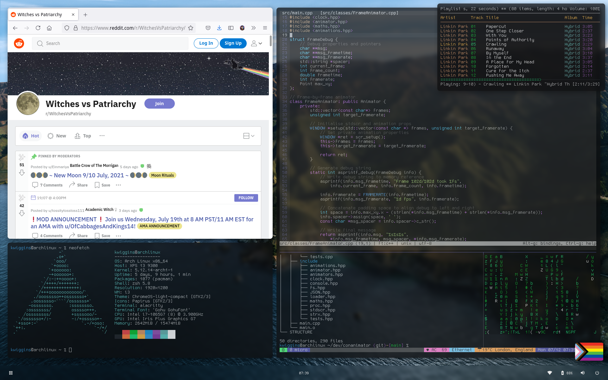

# Dotfiles

Configuration for Arch Linux

## Screenshots

## Details

**OS** GNU/Linux

**Distro** Arch Linux

**WM** i3-gaps

**Compositor** picom-ibhagwan

**Bar** polybar, original theme by adi1090x (modified)

**Launcher** rofi

**Terminal Emulators** alacritty, kitty

**Shell** zsh

**Shell Theme** grml-zsh-config, powerlevel10k

**AUR Helper** pikaur

**Text Editors** micro, vim, code

**Monospace Fonts** GohuFont, MesloLGS NF, Droid Sans Mono

**UI Fonts** Droid Sans 11pt

**Browser** firefox

**Browser Theme** MaterialFox

**GTK Theme** ChromeOS-light-compact

**Icon Theme** Papirus

**Cursor Theme** McMojave Cursors

**Music Player** mpd + ncmpcpp

## Dependencies and Packages

All packages are listed assuming acces to the main/extra Arch Linux repos and Arch User Repository

**Dependencies**

`bash coreutils git i3-gaps rofi picom-ibhagwan-git polybar fontconfig feh`

**Recommended packages**

`sudo pikaur zsh autotiling alacritty kitty tmux firefox vim micro ttf-droid grml-zsh-config lxappearance physlock xorg-xset xss-lock xorg-xbacklight redshift-gtk autorandr zsh-theme-powerlevel10k-git papirus-icon-theme`

**Other packages, including programs and utilities used**

`lxsession libinput-gestures xorg-xrandr visual-studio-code-bin mpd mpd-mpris mpc ncmpcpp pulseaudio pavucontrol networkmanager libqalculate`

## Installation

- Feel free to copy the files manually, where `config` maps to `$XDG_CONFIG_HOME` and `scripts` maps to `$HOME/scripts`, etc...

*or* keeping in mind that configurations **will** be overwritten

- Run `./install.sh` to install the configuration files automatically

## Tested Versions

- OS
	- Arch Linux x86_64 5.12.14
- Packages
	- See `VERSIONS`

## Documentation

To use this for your own desktop configuration, there are some useful scripts in the `dev` directory:

- `getversions`
	- Read pacman package versions for a specified list of packages into a file
- `testenv`
	- Start a new shell with a clean environment to test the dotfiles scripts

Enjoy! <3